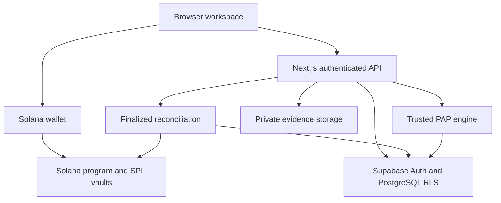

# Pactlance

**Versioned freelance agreements, evidence-based milestone review, and explicit Solana devnet settlement.**

Pactlance helps freelancers and clients agree on what will be delivered, how it will be reviewed, and how a milestone's payment can be allocated. It combines structured work agreements, private delivery evidence, a deterministic workflow engine, and an existing Solana escrow program. The agreement and its payment history remain connected through versioned commitments and verified chain results.

Its approach separates three decisions: agreeing to terms, deciding whether work is eligible for payment, and authorizing an actual token transfer. A deadline or an accepted deliverable does not, by itself, prove that a payment completed.

## Contents

- [Project status](#project-status)
- [Key features](#key-features)
- [How Pactlance works](#how-pactlance-works)
- [Architecture](#architecture)
- [Technology stack](#technology-stack)
- [Repository structure](#repository-structure)
- [Prerequisites](#prerequisites)
- [Installation and local development](#installation-and-local-development)
- [Environment variables](#environment-variables)
- [Testing and validation](#testing-and-validation)
- [Solana devnet configuration](#solana-devnet-configuration)
- [Programmable Agreements Protocol](#programmable-agreements-protocol)
- [Security and trust model](#security-and-trust-model)
- [Known limitations and roadmap](#known-limitations-and-roadmap)
- [Deployment](#deployment)
- [Contributing](#contributing)
- [License](#license)
- [Useful links](#useful-links)

## Project status

**This is a devnet application for development and evaluation. Mainnet and real-money payments are unsupported. TEST tokens have no monetary value.**

| Area                                   | Current status                                                                                                                                                                                                                                                                           |
| -------------------------------------- | ---------------------------------------------------------------------------------------------------------------------------------------------------------------------------------------------------------------------------------------------------------------------------------------- |
| Agreements, evidence, and PAP workflow | Implemented in the application, API, and database migrations. Requires configured Supabase Auth and the complete schema.                                                                                                                                                                 |
| Legacy escrow                          | Implemented: sequential funding, submission, client approval, review-period claims, disputes, mutual allocation, and refunds.                                                                                                                                                            |
| PAP explicit payments                  | Implemented against the existing escrow program. Available only after the compatible program upgrade, capability verification, reviewer-access migration, and server rollout flag.                                                                                                       |
| Automated verification                 | Current local results are recorded below. CI contains web, native Rust, and compiled-program jobs; these do not establish browser payment safety.                                                                                                                                        |
| Hosted application                     | [Pactlance on Vercel](https://pactlance.vercel.app/) is a devnet deployment. On 2026-10-09, public health reported source revision `dbf32c024b61e046f40ad0836176cd43ec6b7f7d` and `realMoneyPaymentsEnabled: false`. This is a dated observation, not a continuing deployment guarantee. |
| Browser-wallet verification            | The repository does not contain a reproducible, completed two-wallet browser run with all signatures, balances, recovery cases, and privacy checks. Use the runbooks to record outcomes for the exact deployment.                                                                        |
| Security review and pilots             | No independent security audit or documented observed customer pilot is established by the repository.                                                                                                                                                                                    |

The public health endpoint checks configuration presence; it does **not** certify deployed program bytes, PAP capability, migrations, private-data access, or completed payments. The committed initial deployment manifest and older verification reports are historical evidence, not proof that a current deployed binary matches current source.

## Key features

| Feature                                | Implemented behavior and boundary                                                                                                                                                                                             |
| -------------------------------------- | ----------------------------------------------------------------------------------------------------------------------------------------------------------------------------------------------------------------------------- |
| Shared agreements                      | Either participant can create a project. Both review versioned scope, milestone amounts, deadlines, and named reviewers before consenting. Sharing a project link does not grant access.                                      |
| Consent and amendments                 | Wallet-signed off-chain acceptance binds the project, version, terms hash, origin, and devnet. Material amendments preserve earlier versions and require fresh consent; settled work cannot be rewritten.                     |
| Programmable Agreements Protocol (PAP) | Templates, deliverables, acceptance criteria, evidence requirements, review windows, revision limits, timeout policies, amendments, and an execution timeline. Server evaluation is trusted.                                  |
| Evidence                               | Private file uploads and HTTPS links, explicit deliverable selections, server-verified file commitments, and scoped downloads. File-format checks are not malware scanning.                                                   |
| Disputes and cancellation              | Participant workflows, exclusive primary/backup reviewer handoff, exact allocation decisions, and mutual cancellation. Off-chain decisions require separate chain authorization to move funds.                                |
| Escrow                                 | Existing program-derived accounts and SPL Token vaults; one funded milestone at a time, fixed participants and mint, and conserved settlement allocations. Requires the intended devnet deployment.                           |
| Recovery and history                   | Signed transaction persistence before broadcast, retry/recovery checks, finalized account validation, event backfill, and idempotent reconciliation. A requested or pending transaction is never sufficient proof of payment. |
| Authentication and access control      | Supabase Solana Web3 sign-in, verified server identities, PostgreSQL row-level security (RLS), private storage, participant/reviewer scopes, and shared per-user API quotas.                                                  |
| Operations                             | Notifications, receipts, restricted support notes, and a bearer-protected legacy claim worker. Scheduling must be configured separately; the worker skips PAP payments.                                                       |

## How Pactlance works

1. **Create terms.** A client or freelancer creates a project with scope, amounts, deadlines, four distinct participant/reviewer wallets, and optional PAP rules. Templates are editable starting points.
2. **Review and consent.** Both participants review and wallet-sign the applicable immutable version. Escrow creation binds terms to the configured program and mint; both wallets separately accept the bound terms on chain.
3. **Fund a milestone.** The client authorizes the exact TEST amount. Confirm finalized funding before treating the milestone as financially protected. Only one milestone can have an active vault obligation at a time.
4. **Submit evidence.** The freelancer uploads or links required evidence and selects it for each deliverable. For PAP payments, the freelancer also publishes the validated delivery commitment with a wallet transaction.
5. **Review the work.** The client acknowledges the review notice, accepts, requests an allowed revision, or opens the agreed dispute workflow. A PAP revision does not restart the original review clock.
6. **Establish settlement eligibility.** Acceptance, agreed timeout prerequisites, a mutual allocation, or a reviewer decision may make a payment eligible. An off-chain dispute must also be explicitly locked on chain to block direct chain actions.
7. **Authorize and finalize settlement.** The client signs approval for the exact published delivery, both participants authorize a mutual allocation, or the eligible reviewer signs a dispute allocation. Submitted and confirmed/finalized transactions are distinct stages.
8. **Reconcile the result.** Pactlance verifies finalized chain accounts and the successful settlement event, then records the actual signature, allocation, and milestone payment state. Check the recipients' token balance changes as well.

**Escrow** holds tokens in program-controlled vaults until permitted settlement conditions are met. **Settlement reconciliation** connects authoritative chain results back to application history.

### Legacy and PAP payment profiles

| Behavior               | Legacy escrow                                                                                                             | PAP explicit payment profile                                                                                                                                              |
| ---------------------- | ------------------------------------------------------------------------------------------------------------------------- | ------------------------------------------------------------------------------------------------------------------------------------------------------------------------- |
| Review policy          | A positive on-chain review period.                                                                                        | Detailed off-chain PAP policy; `review_seconds = 0` identifies the separate chain profile.                                                                                |
| Delivery               | Legacy submission instruction.                                                                                            | Dedicated submission instruction publishing the server-validated delivery hash.                                                                                           |
| Client payment         | Legacy approval instruction.                                                                                              | Dedicated approval instruction naming the exact current delivery hash.                                                                                                    |
| Timeout                | A qualifying undisputed delivery can be claimed after review; qualifying non-delivery can be refunded after its deadline. | A timer can require human review or mark eligibility under agreed prerequisites. It cannot automatically transfer funds. Legacy timer claims/refunds reject PAP accounts. |
| Dispute and allocation | Chain dispute, mutual allocation, and eligible reviewer settlement.                                                       | Off-chain decision plus explicit chain dispute/settlement authorization; the chain's reviewer clock remains authoritative.                                                |
| Scheduled worker       | May execute eligible legacy claims using a separate fee payer.                                                            | Explicitly skipped. No participant or reviewer key is delegated to the worker.                                                                                            |

## Architecture



- **Browser and wallet:** display terms and permitted actions; request Solana devnet signatures. The signing layer checks the returned message, signer, chain, and retained partial signatures.
- **Next.js server:** verifies Supabase identities, validates input and authorization, evaluates PAP transitions, and prepares payment actions. It holds privileged database credentials and is trusted for those responsibilities.
- **Supabase:** stores immutable agreement versions, consent references, private evidence metadata, execution state, and append-only transition history. RLS restricts reads; service-only transaction functions lock state and reject stale or duplicate changes.
- **Solana program:** enforces chain participants, token/program identities, amounts, sequential vault obligations, delivery commitments, settlement signatures/nonces, and reviewer eligibility. It cannot inspect private evidence or judge subjective work quality.
- **Reconciliation:** validates finalized accounts and transactions before recording payment completion. A finalized transaction is accepted at Solana's finalized commitment; the application additionally checks success, the expected program/event, and exact allocation.

Important routes are `/` (landing), `/workspace` (project workspace), `/guide` (usage guidance), and `/preview` (sample fixtures, not a live payment demonstration). Authenticated APIs cover projects, PAP, escrow, evidence, profile, operations, and support. `/api/health` exposes limited configuration status; `/api/worker` requires the configured bearer secret.

## Technology stack

Versions below are pinned in the current manifests/lockfile, rather than inferred from design plans.

| Technology                 | Version               | Purpose                                                                    |
| -------------------------- | --------------------- | -------------------------------------------------------------------------- |
| Node.js / npm              | 24.19.0 / 11.9.0      | Application runtime and dependency installation.                           |
| Next.js / React            | 16.3.8 / 19.3.0       | App Router pages, server APIs, and interactive UI.                         |
| TypeScript / Tailwind CSS  | 6.0.3 / 4.3.3         | Typed application code and styling.                                        |
| Zod                        | 4.6.5                 | Server-validated schemas and bounded PAP rules.                            |
| Supabase JS / SSR          | 2.117.2 / 0.12.7      | Auth, PostgreSQL/storage access, and server cookies.                       |
| Anchor / Anchor client     | 0.32.2                | Solana program and typed client integration.                               |
| Solana web3.js / SPL Token | 1.99.0 / 0.4.15       | Transactions, account validation, and token operations.                    |
| Wallet adapter React       | 0.15.40               | Wallet Standard discovery and React wallet integration.                    |
| Vitest / PGlite / LiteSVM  | 5.0.3 / 0.5.8 / 1.5.0 | Application tests, local SQL/RLS tests, and compiled Solana runtime tests. |
| ESLint / Prettier          | 9.39.5 / 3.9.9        | Linting and formatting.                                                    |
| GitHub Actions             | Repository workflow   | Web, Rust, and SBF runtime checks on pushes and pull requests.             |

The AI-agent agreement template describes a kind of freelance work; it is not an integrated AI agent service. No committed Playwright/browser automation suite establishes browser-wallet compatibility.

## Repository structure

```text
src/
  app/                    Pages and authenticated API routes
  components/             Workspace, agreement, PAP, evidence, and payment UI
  lib/agreements/         Canonical terms, consent, and signatures
  lib/pap/                Schema, templates, transitions, and payment reconciliation
  lib/escrow/             Chain client, snapshots, signing, recovery, and worker
  lib/supabase/           Browser/server database and Auth clients
contracts/
  programs/pactlance/src/ Anchor program
  idl/                    Checked-in client interface
  devnet-deployment.json  Public deployment identities
supabase/
  migrations/             Ordered database, RLS, storage, and RPC migrations
  config.toml             Local Supabase configuration
scripts/                  Diagnostics, preflight, deployment, upgrade, and worker tools
tests/                    Application and local database tests
integration/              Compiled SBF/LiteSVM tests
devnet/                   State-changing scripted devnet journeys
docs/                     Architecture, implementation notes, and validation runbooks
.github/workflows/ci.yml  CI checks
.env.example              Environment variable template
```

## Prerequisites

| Task                        | Requirements                                                                                                                                                                                               |
| --------------------------- | ---------------------------------------------------------------------------------------------------------------------------------------------------------------------------------------------------------- |
| Web application             | Git, Node.js **24.19.0**, npm **11.9.0**. The declared Node range is `>=24.19.0 <25`.                                                                                                                      |
| Application/database tests  | The same Node tools and `npm ci`. SQL tests use local PGlite; they do not require a hosted database.                                                                                                       |
| Native contract tests       | Rust **1.90.0**, Cargo, and rustfmt; see [rust-toolchain.toml](contracts/rust-toolchain.toml).                                                                                                             |
| Compiled SBF/LiteSVM tests  | Agave/Solana tools **2.3.0**, `cargo-build-sbf` platform-tools **v1.56**, Rust tools, and installed npm dependencies. Use Linux or Ubuntu under WSL on Windows.                                            |
| Devnet payment verification | Configured Supabase for browser workflows, compatible Solana wallet accounts, devnet SOL for fees/rent, TEST tokens, the intended program/mint, and the correct operator key files for privileged scripts. |

Anchor is pinned to **0.32.2** in contract configuration. The provided SBF build and Node deployment helpers do not require the Anchor CLI. `npm run doctor` inventories Node, Rust, Cargo, Solana, and Anchor; missing optional tooling can make this broad diagnostic fail. It is not a payment-readiness check.

Native Rust and Solana platform-tools use separate compiler toolchains. Do not substitute an older SBF compiler merely because native Rust tests pass.

## Installation and local development

### 1. Clone and install

These Git/npm commands also work in PowerShell:

```sh
git clone https://github.com/umerf23/Pactlance.git
cd Pactlance
git switch main
node --version
npm --version
npm ci
```

Install the versions above before `npm ci`. In Ubuntu/WSL with an existing nvm installation, `nvm install` and `nvm use` read `.nvmrc`.

Copy the actual template in PowerShell:

```powershell
Copy-Item .env.example .env.local
notepad .env.local
```

Or in Ubuntu/WSL:

```sh
cp .env.example .env.local
nano .env.local
```

Use your own project configuration. A cloned repository contains no deployer, mint-authority, or participant private keys.

### 2. Configure Supabase

1. Create or select the intended Supabase project. Obtain its project URL, publishable key (or legacy anon key), and server service-role key. Put them in the matching variables below.
2. Enable **Solana Web3** sign-in in Supabase Auth. Configure the local site origin `http://localhost:3000` and explicitly allowed hosted/preview origins for the environments you use. See [local Supabase configuration](supabase/config.toml) for the checked-in Web3 settings.
3. For a **new database**, review and apply every SQL migration below in order, using the project's SQL editor or your reviewed migration workflow. They define tables, grants, RLS, service-only RPCs, and the private evidence bucket; a partial schema is insufficient.
4. For an **existing database**, inspect its migration history and definitions first. Back up data and reconcile historical migration names; do not blindly reapply migrations or reset the database.

| Order | Checked-in migration                                                                                                 |
| ----- | -------------------------------------------------------------------------------------------------------------------- |
| 1     | [202610070001_phase3.sql](supabase/migrations/202610070001_phase3.sql)                                               |
| 2     | [20261007050111_private_auth_helpers.sql](supabase/migrations/20261007050111_private_auth_helpers.sql)               |
| 3     | [20261008045813_phase6_evidence_operations.sql](supabase/migrations/20261008045813_phase6_evidence_operations.sql)   |
| 4     | [20261008054824_phase7_reconciliation.sql](supabase/migrations/20261008054824_phase7_reconciliation.sql)             |
| 5     | [20261008060103_phase7_worker_hardening.sql](supabase/migrations/20261008060103_phase7_worker_hardening.sql)         |
| 6     | [20261009094002_audit_api_limits.sql](supabase/migrations/20261009094002_audit_api_limits.sql)                       |
| 7     | [20261009111636_programmable_agreements.sql](supabase/migrations/20261009111636_programmable_agreements.sql)         |
| 8     | [20261009174010_pap_payment_reviewer_access.sql](supabase/migrations/20261009174010_pap_payment_reviewer_access.sql) |

The existing project's hosted history has different timestamps for the last three migrations: `20261009105724_audit_api_limits`, `20261009151959_programmable_agreements`, and `20261009180141_pap_payment_reviewer_access`. Different timestamps do not mean those changes are missing. Verify definitions and history before applying anything.

### 3. Run the application

```sh
npm run dev
```

Open [http://localhost:3000](http://localhost:3000), then the workspace. The landing and sample preview can render without a live payment setup; authenticated project operations require Supabase. Escrow needs the configured program and mint. Keep PAP payments disabled until its separate rollout gates pass.

For a local production build:

```sh
npm run build
npm run start
```

Changes to environment variables require restarting the server; `NEXT_PUBLIC_*` changes also require rebuilding a production application.

## Environment variables

Confirmed by [.env.example](.env.example) and source. **Every `NEXT_PUBLIC_*` value is visible to browser users.** Public RPC endpoints must not contain private provider keys. `.env.local` is ignored by Git and must remain uncommitted.

| Variable                               | Purpose                                               | Required when                                                | Visibility          | Safe example or placeholder                       |
| -------------------------------------- | ----------------------------------------------------- | ------------------------------------------------------------ | ------------------- | ------------------------------------------------- |
| `NEXT_PUBLIC_SOLANA_NETWORK`           | Allowed network; only devnet is supported.            | Defaults to devnet; set explicitly for deployments.          | Client/public       | `devnet`                                          |
| `NEXT_PUBLIC_SOLANA_RPC_URL`           | Browser RPC; fallback for server/tools.               | Defaults to the public devnet endpoint.                      | Client/public       | `https://api.devnet.solana.com`                   |
| `NEXT_PUBLIC_SUPABASE_URL`             | Supabase project URL.                                 | Authenticated workspace.                                     | Client/public       | `https://YOUR_PROJECT.supabase.co`                |
| `NEXT_PUBLIC_SUPABASE_PUBLISHABLE_KEY` | Preferred public Supabase key.                        | Auth, unless anon fallback is used.                          | Client/public       | `<publishable-key>`                               |
| `NEXT_PUBLIC_SUPABASE_ANON_KEY`        | Legacy fallback public key.                           | Only if publishable key is absent.                           | Client/public       | `<anon-key>`                                      |
| `SUPABASE_SERVICE_ROLE_KEY`            | Privileged API database operations.                   | Authenticated server writes and deployment quota check.      | Server secret       | `<server-service-role-key>`                       |
| `NEXT_PUBLIC_ESCROW_PROGRAM_ID`        | Intended escrow program.                              | Escrow/payment workflows.                                    | Client/public       | `<program-public-key>`                            |
| `NEXT_PUBLIC_TEST_TOKEN_MINT`          | Intended six-decimal TEST mint.                       | Escrow/payment workflows.                                    | Client/public       | `<mint-public-key>`                               |
| `PAP_PAYMENTS_ENABLED`                 | Explicit PAP payment rollout gate.                    | Defaults disabled; exact `true` only after verified rollout. | Server              | `false`                                           |
| `SOLANA_RPC_URL`                       | Private server/operator verification RPC.             | Optional; overrides public fallback.                         | Server/operator     | `https://api.devnet.solana.com`                   |
| `CRON_SECRET`                          | Bearer authorization for claim worker.                | Scheduled worker; at least 32 characters.                    | Server secret       | `<random-worker-token>`                           |
| `CLAIM_WORKER_SECRET_KEY`              | Dedicated devnet fee payer, base58 or JSON key bytes. | Automated legacy claims; omit for manual claims.             | Server secret       | `<dedicated-fee-payer-secret>`                    |
| `WORKER_APP_URL`                       | Application targeted by worker loop.                  | Defaults to local origin; HTTPS for hosted use.              | Operator            | `http://127.0.0.1:3000`                           |
| `APP_URL`                              | Target for read-only deployment checks.               | `check:deployment`.                                          | Operator            | `http://127.0.0.1:3000`                           |
| `DEPLOYER_KEYPAIR`                     | Local path to existing deployment authority keypair.  | Deployment/upgrade and scripted devnet tests.                | Local operator only | `/absolute/path/devnet-authority-keypair.json`    |
| `MINT_AUTHORITY_KEYPAIR`               | Local path to TEST mint authority.                    | `mint:test`.                                                 | Local operator only | `/absolute/path/test-mint-authority-keypair.json` |
| `DEPLOY_CLI_RPC_URL`                   | Optional separate RPC transport for deployment CLI.   | Optional; must also be devnet.                               | Local operator      | `https://api.devnet.solana.com`                   |

`NODE_ENV` is managed by the runtime/framework; `VERCEL_GIT_COMMIT_SHA` is supplied by Vercel for the health revision. Neither needs a manually invented value.

Never put the service-role key or wallet secrets in public variables. Keep operator keypair files on the operator's computer, outside Git; do not upload deployment/mint authority keys to Vercel. Use a separate, limited fee payer if running legacy claims. The scripted devnet journeys currently require `DEPLOYER_KEYPAIR` to control the TEST mint as well; `MINT_AUTHORITY_KEYPAIR` is used by the separate mint helper.

## Testing and validation

### Local checks: no devnet transactions

| Command                              | Scope and prerequisites                                                                                                      |
| ------------------------------------ | ---------------------------------------------------------------------------------------------------------------------------- |
| `npm run check`                      | Secret-pattern screening, ESLint, TypeScript, `npm test`, and production build. Node dependencies required.                  |
| `npm run lint` / `npm run typecheck` | Lint and TypeScript checks individually.                                                                                     |
| `npm test`                           | Application, authorization, PAP, recovery, and local PGlite migration/RLS tests under `tests/`. No hosted database required. |
| `npm run format:check`               | Read-only repository-wide Prettier check. `npm run format` writes files; use it deliberately.                                |
| `npm run test:program`               | Native Cargo tests; use pinned Rust. Not validator execution.                                                                |
| `npm run test:escrow`                | Three LiteSVM suites running actual compiled escrow/SPL programs; build the SBF artifact first.                              |
| `npm run doctor`                     | Tool availability/version inventory; not deployment verification.                                                            |

Equivalent pinned native and SBF commands, from the repository root in Linux/WSL:

```sh
cargo +1.90.0 fmt --manifest-path contracts/Cargo.toml --all --check
cargo +1.90.0 test --manifest-path contracts/Cargo.toml --workspace --locked
cargo-build-sbf --tools-version v1.56 --manifest-path contracts/programs/pactlance/Cargo.toml -- --locked
npm run test:escrow
```

The SBF compiler above is Agave 2.3.0's tool. Its first run downloads a substantial platform-tools archive. CI installs the same pinned tools; see [ci.yml](.github/workflows/ci.yml). Run `npm test` rather than an unrestricted Vitest invocation: the devnet suites are intentionally separated and send real devnet transactions.

### Operator checks and state-changing commands

| Command                                                                         | Effect and requirements                                                                                                                                                                                                                  |
| ------------------------------------------------------------------------------- | ---------------------------------------------------------------------------------------------------------------------------------------------------------------------------------------------------------------------------------------- |
| `npm run devnet:preflight -- --report validation-results/devnet-preflight.json` | Read-only genesis/program/config/mint checks using configured RPC and public identities. A code hash records observed bytes; it does not compare them to source by itself.                                                               |
| `npm run check:deployment`                                                      | Read-only target health, unsigned API rejection, and server quota-RPC availability checks. Needs `APP_URL` and local Supabase server credentials. Does not perform a signed browser journey.                                             |
| `npm run upgrade:pap:devnet`                                                    | Without `--upgrade`, prints usage only.                                                                                                                                                                                                  |
| `npm run upgrade:pap:devnet -- --upgrade`                                       | **State-changing operator action:** builds and upgrades the existing program and initializes capability where needed. Requires explicit upgrade authorization, matching authority, and devnet SOL.                                       |
| `npm run test:pap:devnet`                                                       | **State-changing synthetic PAP journey:** generates test participants, mints TEST, funds and settles projects, tests disputes/recovery, and records finalized results. Requires compatible capability and the configured authority/fees. |
| `npm run test:devnet`                                                           | **State-changing legacy program journey**, separately from PAP. Requires authority, TEST mint, and devnet fees.                                                                                                                          |
| `npm run mint:test -- <participant-wallet> 100`                                 | **State-changing TEST minting** using the local mint authority; creates the recipient token account as needed. Replace the argument placeholder before running.                                                                          |
| `npm run deploy:devnet`                                                         | **Initial deployment helper**, with identity/key management and local configuration changes. Read [Phase 7](docs/phase-7.md) first. Do not use it to upgrade the existing PAP deployment.                                                |
| `npm run worker`                                                                | Persistent loop invoking the authorized claim endpoint. With a funded worker key it may submit eligible **legacy** claim transactions; PAP is skipped.                                                                                   |

Do not run state-changing commands just to inspect the project. Use devnet only, retain authority/buffer backups, and review the target identities first. Reports under `validation-results/` are ignored; inspect and redact them before sharing selected public evidence. A scripted test with generated signers and synthetic hashes does not establish Supabase/browser-wallet correctness.

### Recorded local verification

On **2026-10-09**, against source commit **`dbf32c024b61e046f40ad0836176cd43ec6b7f7d`**:

- `npm run check` passed: secret-pattern screening, lint, typechecking, **132 tests across 24 files**, and production build.
- Pinned Rust formatting and native tests passed: **8 tests**.
- Pinned SBF compilation completed; LiteSVM passed: **24 tests across 3 files**. Compilation emitted tool warnings; these results cover the executed cases, not every possible program path.
- `npm run format:check` failed in three pre-existing files: `contracts/idl/pactlance.json`, `integration/escrow.vm.test.ts`, and `src/components/project-preview.tsx`.
- Public `/`, `/workspace`, and `/api/health` returned HTTP 200; health reported the matching revision and disabled real-money payments.

No program deployment, upgrade, minting, worker execution, scripted live payment, or authenticated browser-wallet payment was performed for this README verification. Older committed reports under [docs/verification](docs/verification/) refer to their own revisions and dates.

## Solana devnet configuration

These public identities agree across [the deployment manifest](contracts/devnet-deployment.json), [Anchor configuration](contracts/Anchor.toml), [program source](contracts/programs/pactlance/src/lib.rs), and [IDL](contracts/idl/pactlance.json):

| Identity                   | Value                                          |
| -------------------------- | ---------------------------------------------- |
| Network                    | Solana devnet                                  |
| Escrow program             | `9T95KC5YSQ7LV2KwUcY7SyBu6cYF6Urv8fXd7kYaWNpL` |
| TEST mint                  | `JCEk9179tFu5y8UQ6oMFSPrDybkXDkhoxMiom2FpyuU7` |
| Mint precision             | 6 decimal places                               |
| Recorded upgrade authority | `Aze8iw5WsDm1YSM78hfT9NscGrR5L4VWxtAVhUNtdRDY` |

Set the public program/mint variables only for the deployment you intend to use. The manifest's `verifiedSlot` is an initial historical observation, not a current compatibility check. Anchor's provider defaults to **Localnet**; the Node devnet scripts perform their own explicit cluster validation.

### Verify and roll out PAP payments

1. Review the exact source commit, compatibility notes, authority, and existing key backups. A clone gives no authority over the recorded deployment. Do not run `anchor keys sync` or generate replacement identities for an existing funded program.
2. Run local application, native, SBF, and LiteSVM checks. Run devnet preflight to verify the cluster genesis, executable program, config, mint precision, and authority assumptions.
3. Verify the complete database schema, including the PAP reviewer-access migration. Reconcile the historical migration timestamp before applying it to an existing database.
4. With explicit authorization, the existing authority, and matching toolchain on PATH, run `npm run upgrade:pap:devnet -- --upgrade`. It verifies both RPC clusters, reuses the existing program/buffer identities, compares finalized deployed bytes and authority, and verifies the owned version-1 PAP capability PDA. Review `validation-results/pap-upgrade.json`.
5. Run the explicitly authorized `npm run test:pap:devnet`. Review `validation-results/pap-devnet-workflow.json`, successful finalized transaction signatures, allocations, and recipient balances. Failed/incomplete reports must not be treated as passes.
6. Only after these gates pass, set server-only `PAP_PAYMENTS_ENABLED=true` in the intended evaluation environment and rebuild. The backend independently checks finalized capability; the flag alone does not make legacy code compatible.
7. Complete and record the [two-wallet PAP browser run](docs/pap-payments.md#two-wallet-browser-run), plus privacy, wallet, and outage cases in the [validation runbook](docs/validation-runbook.md).

A failed upload with repeated blockhash expiry is not a verified upgrade. Preserve buffer/program keys, keep the gate disabled, and follow [upload-expiry guidance](docs/pap-payments.md#deployment-upload-expiry). A private dedicated devnet transport belongs in local `DEPLOY_CLI_RPC_URL`, never a public variable or committed URL.

Do not downgrade to legacy-only program code while PAP obligations remain funded. Disabling the application flag does not revoke existing on-chain settlement authority; retain a compatible recovery procedure.

## Programmable Agreements Protocol

PAP represents work terms as a structured, versioned protocol rather than a free-form document alone. It is reusable across website development, UI/UX, graphic design, video editing, AI-agent development, writing, custom software, and custom digital work. Templates must be customized and reviewed; a template or hash is not proof of legal enforceability.

### Terms, versions, and consent

- Agreements contain scope, precise milestone amounts, ordered deadlines, parties/reviewers, and PAP deliverables with measurable acceptance criteria and required evidence types.
- PAP v1 uses `pactlance-pap-json-v1` and `offchain_workflow`. It validates IANA time zones, 1–720-hour review windows, 0–10 allowed revisions, and up to 20 milestones.
- Canonical hashing uses versioned, salted SHA-256 commitments, deterministic key ordering, ordered arrays, UTF-8 encoding, and normalized PAP strings. Mutable execution/payment state is excluded from immutable terms. Money is parsed into integer token base units and calculated with `BigInt`/on-chain integer types, not floating-point financial arithmetic.
- Off-chain wallet consent and on-chain bound acceptance are distinct records. PAP payment terms bind schema version 3 and `pap_explicit_v1` to the program/mint; off-chain acceptance does not replace chain acceptance or deposit tokens.
- Material amendments require a new version and both approvals. Active versions remain pinned until authorized adoption. Completed/settled milestones cannot be retroactively changed; compatible future-work chain revisions require both participants.

### State and bounded rules

The centralized transition engine checks actor, current state, agreement version, deadlines, evidence, approvals, and payment conditions. Meaningful changes record actor, previous/new state, reason, rule IDs, version, and time in append-only history. Database locks, revision comparisons, and payload-bound idempotency reject stale or duplicate processing.

Typical milestone execution states include `PENDING`, `IN_PROGRESS`, `UNDER_REVIEW`, `CHANGES_REQUESTED`, `DISPUTED`, `PAYMENT_PENDING`, and `CANCELLED`. Only verified financial reconciliation records `PAID` or `REFUNDED`. A completed work-decision workflow does not necessarily mean every token payment has completed.

Rules are limited to four boolean facts—`review_elapsed`, `evidence_missing`, `revision_exhausted`, and `submission_late`—with the `is` operator. At most 12 rules can request information, require human review, open a dispute, or mark payment eligibility. The engine does not execute arbitrary user code, JavaScript, or unrestricted functions.

Required evidence must be ready and explicitly mapped to each deliverable; simply uploading a file does not submit it. The default timeout requires human review. An agreed eligibility policy additionally checks its elapsed-review, notice, evidence, and dispute prerequisites; it still cannot broadcast a PAP payment. Evidence presence or timer expiry cannot establish objective quality.

Cancellation consent and reviewer decisions are authenticated workflow records, not cryptographic payment signatures. An off-chain dispute does not lock a chain vault until a participant's dispute-lock transaction finalizes. Mutual chain settlement is a new explicit financial agreement and may allocate differently from an earlier workflow decision; history preserves both the decision and actual allocation.

### Payment completion

The client pays only the currently published delivery commitment. Resubmission replaces that commitment and invalidates pending proposals. Mutual settlements preserve both signatures; reviewer settlement enforces the exclusive primary/backup handoff. Allocations go to original participants and conserve the recorded obligation rather than treating vault donations as owed payment.

The server records `PAID` or `REFUNDED` only after a validated finalized snapshot and a successful finalized `MilestoneSettled` transaction event agree on the expected program, project, and exact allocation. Missing, pending, failed, or inconsistent history leaves payment unverified. This workflow relies on server/database operation and RPC availability; it is not autonomous trustless execution of all agreement rules.

See [PAP terms and workflow](docs/programmable-agreements.md) and [PAP payments and compatibility](docs/pap-payments.md).

## Security and trust model

- **Chain enforcement:** the program verifies signatures, account ownership/derivation, program/mint identities, amount conservation, sequencing, nonces, and settlement authority. Direct transactions are governed by chain state, not frontend buttons or off-chain PAP decisions.
- **Server trust:** the server holds a service-role credential, validates evidence, evaluates rules, and writes application history through restricted RPCs. Operators and compromised privileged infrastructure remain trust considerations.
- **Identity and RLS:** APIs verify Supabase users and their Solana Web3 identity rather than trusting editable metadata. PostgreSQL RLS restricts project/evidence reads to participants and eligible assigned reviewers. Reviewer access is removed after reconciled settlement. Support access is scoped and does not confer payout authority.
- **Private evidence:** the `pactlance-evidence` bucket is private, with a 20 MiB file limit and bounded file types. Completion checks content size, digest, and file signature/type; downloads use authorized short-lived signed URLs. External-link commitments do not freeze remotely hosted content. Chain addresses, amounts, and commitments remain public.
- **Wallet authorization and replay protection:** transactions request `solana:devnet`, verify returned signatures/messages, preserve joint signatures, and use program settlement nonces. Pending signed bytes are retained for recovery rather than blindly creating another payment. API transitions use version/revision locks and idempotency keys.
- **Operational controls:** same-origin mutating requests, bounded validated bodies, and database-backed per-user quotas are implemented. Quota failure blocks protected requests; these controls are not a complete DDoS or Sybil defense. RPC delays/rate limits can block confirmation and history.
- **Upgrades and disputes:** the recorded authority can upgrade the program. Primary/backup reviewers must be available and act within chain authority windows; a creator's reviewer-availability attestation does not prove reviewer consent. Funds can remain locked if required parties/reviewers do not act or infrastructure fails.
- **Review status:** internal tests and remediation documents exist. No independent audit, legal enforceability assessment, or mainnet readiness is established.

Read [Architecture and trust](docs/architecture-and-trust.md) and [Audit remediation](docs/audit-remediation.md) for implementation boundaries and historical findings.

## Known limitations and roadmap

### Verification still required for each release environment

1. Record a complete independent two-wallet browser journey: agreement consent, funding, selected evidence, revision, exact-delivery approval, finalized settlement, token balances, and duplicate-payment rejection.
2. Exercise live pending-transaction reload, delayed/failed RPC, stale history, concurrent refresh, and recovery against the exact hosted commit/program.
3. Verify every claimed wallet/browser combination and mobile behavior. Wallet Standard discovery is implemented; an Ethereum-only wallet account is insufficient. Compatible Solana devnet transaction support must be observed rather than assumed from an extension's name.
4. Verify hosted participant/reviewer/support authorization and private file access, including denied access after settlement. Local SQL tests do not establish a hosted project's exact grants/configuration.
5. Obtain independent program/application security review, an upgrade/recovery procedure, and operational reviewer coverage before considering real-money work.
6. Observe real client/freelancer evaluation sessions and record usability, disputed-work outcomes, and willingness to use/pay. The repository contains no proven customer traction or product-market fit.

### Product and production boundaries

Current payments are six-decimal TEST on devnet, with sequential milestones, original-party allocations, and no implemented fiat/PKR/card checkout or embedded-wallet onboarding. There is no automatic objective deliverable-quality judgment. PAP is an off-chain workflow with explicit on-chain authorization, not an unrestricted contract-language executor.

The [startup-readiness plan](docs/startup-readiness.md) proposes focused pilot work, including video editing. Pilot evidence, sustainable pricing, reviewer governance, and broader payment/network support require further design and validation. They are not shipped integrations or promised dates.

Older phase documents preserve historical blockers and test counts. In particular, Phase 3 funding status and early development/CI descriptions predate the current escrow and SBF tests. The current PAP editor also contains older copy describing transfers as unavailable; actual preparation remains conditional on the API's rollout/capability gates. This README documents current implementation and dated evidence; use the linked runbooks for environment-specific verification.

## Deployment

### Local, preview, and hosted devnet

Local development uses `npm run dev`; a production-style local run uses `npm run build` then `npm run start`. Vercel can host the Next.js application. There is no committed `vercel.json` or scheduler deployment configuration.

1. Import [the GitHub repository](https://github.com/umerf23/Pactlance) into Vercel and select the reviewed branch/commit. Use **repository root** as Root Directory; `package.json` is at the root, not under `src` or `contracts`.
2. Select Next.js, Node 24.x compatible with `.nvmrc`, install command `npm ci`, build command `npm run build`, and the framework's default output setting. Verify the actual build runtime meets the declared Node range.
3. Add the needed public Supabase/network/program/mint values and server-only service-role/private-RPC settings for the appropriate Preview or Production environment. Leave `PAP_PAYMENTS_ENABLED=false` until the PAP rollout gates pass. Do not add local authority key files.
4. Configure Supabase Auth's allowed origins for the exact deployed hostname. Apply/verify migrations on the intended database. Preview code does not automatically isolate a shared Supabase database or shared devnet program; use separate resources where isolation is required.
5. Deploy, inspect build logs, and check `/api/health`, unsigned `/api/projects` rejection, and `npm run check:deployment` from a configured operator environment. Match the reported revision to the reviewed Git commit. Public variable changes require a new build.
6. Test the intended preview with two wallets and record the runbook. Enable PAP payments only after verified program capability, schema, authorization, and scripted checks; then complete browser validation before promoting the evaluated release. Verify the configured Vercel production branch explicitly—changing Git's default branch alone does not prove Vercel changed its branch setting.

Hosting an application in Vercel's **Production** environment does not make devnet tokens real money or establish mainnet readiness.

### Worker operations

A scheduler or persistent Node process must be configured separately if legacy timed claims are wanted. `npm run worker` calls the bearer-protected `/api/worker` using `WORKER_APP_URL` and `CRON_SECRET`. Its optional signer is a dedicated devnet fee payer, never a participant/reviewer/mint/upgrade key. PAP is skipped. Deploying the web app alone does not start this loop or install a Vercel Cron job.

## Contributing

Open an [issue](https://github.com/umerf23/Pactlance/issues) with a reproducible problem, relevant source/deployment revision, expected and actual behavior, and redacted logs. Public devnet signatures can help diagnose settlement; never include credentials, private endpoints, private evidence, or keypair files.

Use a branch and pull request for changes. Run the applicable web and contract checks, include their actual results and limitations, and document compatibility/migration implications. Review terms hashes and funded-account compatibility before changing schemas or contracts. Do not deploy upgrades, alter a hosted database, or use mainnet funds as part of an ordinary test run.

## License

No license file is present in the inspected repository. An MIT, Apache, or other open-source license must not be assumed; the owner needs to choose and add a license before representing the project as licensed for reuse.

## Useful links

- [GitHub repository](https://github.com/umerf23/Pactlance)
- [Hosted devnet application](https://pactlance.vercel.app/)
- [Sample preview](https://pactlance.vercel.app/preview) — fixture UI, not a wallet payment proof
- [Architecture and trust](docs/architecture-and-trust.md)
- [Programmable Agreements Protocol](docs/programmable-agreements.md)
- [PAP payments and browser run](docs/pap-payments.md)
- [Validation runbook](docs/validation-runbook.md)
- [Phase 8 validation history](docs/phase-8.md)
- [Audit remediation history](docs/audit-remediation.md)
- [Startup readiness](docs/startup-readiness.md)
- [CI workflow](.github/workflows/ci.yml)
- [Issue tracker](https://github.com/umerf23/Pactlance/issues)
