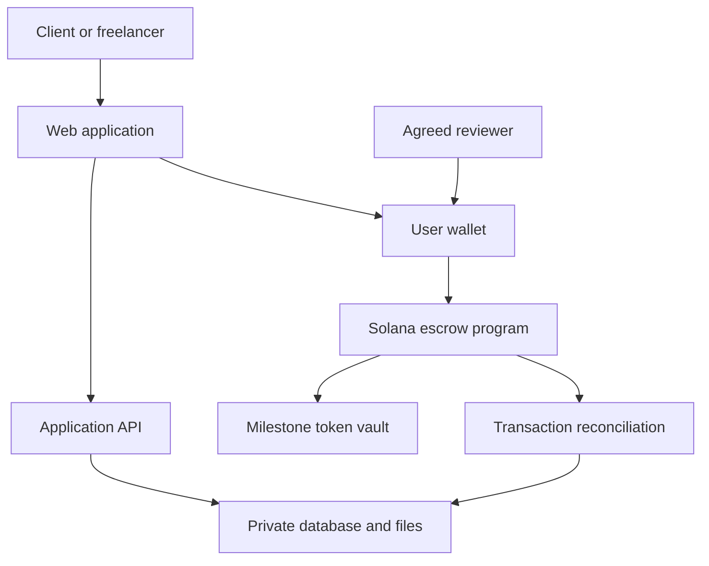

# FreelancePay — Project Blueprint

Prepared: 6 October 2026
Status: Proposed design; no software has been built.
Working assumption: This plan covers the first recommended idea, payment protection for Pakistani freelancers working with overseas clients. The name is provisional.
Hackathon areas: Payments and FinTech; Stablecoins; Commerce.
Planning target: A six-week Solana devnet prototype with two developers, including one familiar with Rust and Anchor.

## 1. Complete problem statement

Pakistani freelancers and small agencies serving overseas clients need a dependable way to agree on work, confirm that payment is available, and collect their earnings after delivery. For relationships established through referrals, social media or personal websites, the agreement, delivery evidence and payment records can be spread across unrelated tools. This creates uncertainty over funding, acceptance, changes to the work and dispute handling. International payment access adds further friction.

FreelancePay proposes a shared milestone agreement funded through a Solana escrow program. Both parties accept the work description, amount, deadlines and dispute process before payment is deposited. The freelancer can verify committed funds before starting. Payment is released according to the accepted rules, while disputed funds follow a defined review process.

The intended result is less exposure to unpaid work and clearer payment status for freelancers, alongside controlled releases and an evidence trail for clients. Success must be measured through actual user trials. The product cannot itself guarantee work quality, settle every dispute fairly, or turn stablecoins into usable Pakistani rupees without an appropriate payment partner.

PIDE's 2026 analysis documents international payment-access barriers for Pakistan's digital service exporters [1]. The narrower assumptions about non-payment frequency, willingness to fund milestones, and demand for this particular product require interviews. Existing competitors include Upwork Direct Contracts [2].

## 2. Initial customer and value proposition

Start with Pakistani freelance video editors and small editing agencies working with overseas agencies on fixed-price batches of videos. This is a proposed first segment, chosen because deliverables can be divided into small, understandable milestones.

- Freelancer's job: Know that the next batch is funded before spending time on it.
- Client's job: Pay against clearly described work and retain an agreed route for disputes.
- Reviewer’s job: Evaluate the agreed terms and evidence, then authorize a permitted settlement.
- Product promise: Agree on a milestone, confirm funding, deliver, and settle under known rules.

Illustrative transaction: A client orders ten videos for 500 units of a dollar-denominated stablecoin, divided into two 250-unit milestones. The first milestone is funded before the first five videos are produced. The second is a separate escrow funded before the next batch. These are example amounts, not market prices or promised earnings.

For the first prototype, use a clearly labelled project test token on Solana devnet. It is not real USDC or real money. Later live support for a verified stablecoin mint depends on security review and a suitable operating model.

## 3. What to build first

The first useful product is a responsive web application. One project can contain sequential milestones, with one funded milestone active at a time.

### Required prototype features

1. Wallet connection and authenticated sign-in.
2. Freelancer and client dashboards.
3. A shared agreement page with scope, acceptance criteria, amount, delivery deadline, review period and reviewer identity.
4. Both parties’ acceptance of the exact agreement version.
5. Funding of a single milestone into its own program-controlled vault.
6. Private delivery links/files and an on-chain submission reference.
7. Client approval and release to the agreed freelancer wallet.
8. Time-based claim after the agreed review period, provided no dispute was raised.
9. Non-delivery refund under the agreed deadline conditions.
10. Mutual settlement or cancellation.
11. Dispute opening, evidence access and a reviewer-authorized split or refund.
12. Transaction status, history and explorer links.
13. In-app reminders and a minimal administrative support view.

### Subsequent work

PKR payout integration, card funding, embedded wallets, email/SMS automation, agency payment splits, subscriptions and richer accounting exports belong after the core workflow is validated. They are not prerequisites for demonstrating the escrow on devnet.

A job marketplace, matching engine, lending product and AI features are outside this initial product scope.

## 4. Proposed payment rules

Finalize these rules with prospective users before coding. The timings below are prototype defaults, not legal recommendations.

| Event | Rule |
| --- | --- |
| Agreement | Both wallet owners accept the same version and reviewer before funds can be deposited. |
| Funding | Only the agreed client funds the exact amount of the allowed test-token mint. Set a funding deadline before the delivery deadline. |
| Start | The freelancer starts after the application verifies confirmed funding; final settlement history is reconciled against finalized chain state. |
| Delivery | The freelancer submits once before the delivery deadline. The private evidence package is associated with a versioned hash/reference. |
| Review | The client has an agreed review window, for example 72 hours from recorded submission. |
| Approval | Client approval atomically settles the milestone to the fixed recipient. |
| No response | After the review deadline, a permissionless claim can settle to the fixed freelancer recipient only if no dispute is open. |
| No delivery | Once the delivery deadline passes with no recorded submission and no dispute, the client can claim the agreed refund. |
| Dispute | Either party may open a dispute from a permitted active state. Review-window disputes must be recorded strictly before its expiry. Ordinary releases/refunds stop. |
| Mutual agreement | Both parties can sign the same settlement allocation; the program checks that allocations equal the unsettled amount. |
| Review decision | The pre-agreed reviewer can settle a disputed milestone only to the original client and freelancer accounts. The reviewer cannot pay itself or an arbitrary third party. |
| Reviewer unavailability | Permit a named backup reviewer after an agreed deadline. The prototype must disclose that if reviewers and parties never act, disputed funds can remain locked. A production long-stop process needs separate review. |
| Further work | A new milestone or new agreement is needed for additional work; funded terms cannot be edited silently. |

A smart contract does not wake up when a deadline arrives. A user or scheduled worker must submit a transaction, and the program checks eligibility at execution time. The user should retain a manual claim action if the worker is unavailable.

The review deadline must be visible before funding. Silence-based release is an accepted product rule, not proof that the work is good. Submission availability and notifications are essential; the prototype must not present automatic release as an unconditional quality guarantee.

## 5. Architecture

The browser prepares payment actions and asks the user’s wallet to sign. The server stores project details and checks permissions. The Solana program is authoritative for deposited amounts, release permissions and settlement.

The reviewer uses its own wallet session. The common wallet node represents each user’s wallet, not a shared key.

### On-chain records

Store participant and reviewer public keys, the permitted token mint, amount in integer token units, agreement commitment, milestone identifier, deadlines, status and settlement totals. Use a distinct program-derived account and token vault for each milestone.

### Off-chain records

Store names, contact details, full scope, invoices, private deliverables, evidence, notification preferences and support notes in the database/private storage. Avoid personal data or private deliverable URLs in transaction memos. A salted hash helps verify a document version but does not make publicly recorded wallet addresses or payment amounts private.

Suggested database tables: profiles, projects, project_members, agreements, milestone_cache, evidence, disputes, transaction_events and notifications. Payment status fields are a chain-derived cache; changing a database row must never release funds.

## 6. Recommended stack

| Layer | Choice | Purpose |
| --- | --- | --- |
| Web interface | Next.js App Router, React, TypeScript | Responsive screens and shared application types |
| UI | Tailwind CSS; a small reusable component set | Consistent forms, status displays and mobile layout |
| Server | Next.js route handlers on Node.js | Authentication checks, metadata APIs and evidence access |
| Database | Supabase Postgres | Relational project data and audit records |
| Authentication | Supabase Auth with Solana wallet sign-in | Verify wallet control and establish a server-verifiable session |
| Private files | Supabase Storage with private buckets and RLS | Restrict access to the parties and authorized reviewers |
| On-chain code | Rust and Anchor | Escrow accounts, signer checks and settlement instructions |
| Token movement | SPL Token; a single allowed mint | Deposits, payouts and refunds |
| Client integration | Anchor TypeScript client, compatible Solana web3.js v1, SPL Token client and wallet adapter | Construct and sign program calls |
| Wallet for testing | A compatible Solana wallet, such as Phantom | Separate client, freelancer and reviewer test identities |
| Network access | Solana devnet RPC; a provider such as Helius when needed | Read program state and submit transactions |
| Reconciliation | Scheduled Node.js task with idempotent event handling | Recover from missed events and update payment status |
| Program tests | Rust tests with LiteSVM plus local-validator/devnet integration | Check permissions, balances and deadline behavior |
| Application tests | Vitest and Playwright | API logic and the complete browser workflow |
| Source control | Git and GitHub; CI for checks | Reproducible builds, reviews and contribution history |
| Hosting | Vercel for the Next.js app; an appropriate scheduled-job runtime | Serve the application and reconciliation job |

Compatibility decision: Anchor’s current TypeScript documentation uses `@anchor-lang/core` with legacy `@solana/web3.js` v1 and the wallet adapter [3]. This blueprint deliberately uses that coherent integration path. Solana’s general documentation recommends Kit for new general-purpose clients [4]; adopting it would require a corresponding generated-client strategy rather than assuming drop-in compatibility with Anchor’s TypeScript API. Pin tested versions in lockfiles and the toolchain configuration.

Supabase documents Solana wallet authentication [5] and row-level controls for private storage [6]. Anchor documents LiteSVM for program testing [7]. A prototype needs no AI API or custom cryptocurrency.

## 7. Contract interface and essential checks

Suggested instructions: create_milestone, accept_terms, fund_milestone, submit_work, approve_release, claim_after_review, refund_non_delivery, open_dispute, mutual_settlement and resolve_dispute.

Use Rust integer token units for calculations. Every money-moving instruction must validate the signer role, account ownership, milestone identity, token mint, token-program identity, vault authority, fixed destinations and permissible state transition.

Essential properties:

- Total payouts and refunds never exceed the recorded funded amount.
- A settled milestone cannot be paid or refunded a second time.
- An unrelated wallet cannot modify or settle another project.
- A different token or fake vault cannot satisfy the deposit requirement.
- Funded terms and recipients cannot be changed by a database edit.
- Disputed funds cannot take the ordinary release path.
- Release and dispute boundary times are defined consistently.
- A failed or retried transaction cannot create a duplicate settlement.
- Evidence access is checked independently from whether someone knows a project URL.
- The application never asks for or stores users’ seed phrases or private keys.

For the prototype, keep platform payment fees at zero to simplify accounting. Monetization can first be tested through interviews. Live reviewer and upgrade authority are material trust assumptions. Before real funds, define multisignature/key management, upgrade governance, incident handling and independent security review.

## 8. Six-week delivery schedule

Estimate assumptions: Two developers contribute roughly 25–30 hours each per week; one can build the web application and one can implement/review Anchor code. User research and product decisions happen alongside development. This is approximately 300–360 developer-hours for a narrow prototype, with uncertainty for integration and defects.

| Week | Work | Finished outcome |
| --- | --- | --- |
| 1 | Interview 8–10 freelancers and 3–5 clients; inspect actual payment workflows; compare alternatives; write rules, wireframes and acceptance tests; configure local tools | One selected user segment, agreed scope and a clickable flow |
| 2 | Implement agreement acceptance, deposit vault, approval release and core tests; start auth, project forms and database permissions | Locally tested fund-and-release flow plus an application skeleton |
| 3 | Implement submission, timeouts, refunds, disputes and mutual settlement; build client and reviewer screens; test adversarial cases | Complete escrow state machine and working private evidence access |
| 4 | Integrate wallet signing, transaction states, reconciliation and devnet deployment | End-to-end devnet workflow accessible to test users |
| 5 | Run observed user trials; test deadline boundaries, retries and account permissions; fix usability and security defects | Stable prototype with measured feedback and recorded test evidence |
| 6 | Retest remaining defects; finish mobile layout, README, architecture/trust disclosures, demo video and pitch | Reviewable hackathon submission and post-hackathon plan |

Indicative alternatives:

| Team situation | Planning estimate |
| --- | --- |
| Two developers under the assumptions above | About 6 weeks |
| One experienced web developer learning Solana, 25–35 hours/week | About 10–14 weeks |
| Learning both web development and Solana, 15–20 hours/week | About 4–6+ months |

These are engineering estimates, not promises. Partner onboarding, a live PKR route, independent review and regulatory approvals are not included. A devnet prototype does not establish production readiness.

## 9. Things required

### People and access

- A product owner to recruit users and make scope decisions.
- A developer comfortable with React/TypeScript and database security.
- A developer or regular reviewer comfortable with Rust, Anchor and Solana account security.
- Five or more freelancers and two or more clients for observed prototype trials.
- A designated test dispute reviewer.
- For production, qualified security and legal/regulatory assistance plus an appropriate payment partner.

One person can cover several roles, with a longer schedule.

### Equipment and software

- Laptop, dependable internet, VS Code or a comparable editor, Git and a browser.
- A practical target of 16 GB RAM for a comfortable local workflow; this is a recommendation, not an official minimum.
- Windows users: WSL2 with a Linux development environment. Solana’s installation documentation supports Windows through WSL [8].
- A supported Node.js LTS release satisfying the selected dependencies, Rust, Solana CLI and Anchor Version Manager.
- Separate test wallets for client, freelancer, reviewer and backup reviewer.
- Devnet SOL for fees and a labelled test SPL token.
- GitHub, Supabase, hosting and RPC accounts.
- Test documents with invented identities and no confidential client material.

### Product decisions before implementation

- Exact first user group and supported token/network.
- Scope and acceptance template.
- Delivery and review deadlines.
- Refund, cancellation, revision and dispute rules.
- Reviewer authority and backup availability.
- File retention and access rules.
- Who pays network fees.
- What the product can promise before a PKR integration exists.

## 10. Costs to plan for

Vendor prices were checked on 6 October 2026. The following are examples, not a procurement commitment or a complete operating budget.

| Item | Prototype approach | Paid baseline example |
| --- | --- | --- |
| Local development tools | Open-source tooling | No tool licence purchase required |
| Devnet assets | Faucet SOL and labelled test token | No real payment capital |
| Database and storage | Supabase free tier within its limits | Pro starts at USD 25/month [9] |
| Web hosting | A plan suitable for the project’s use | Vercel Pro starts at USD 20/month; additional developer seats and usage can add cost [10] |
| RPC | Public devnet or provider free tier, within limits | Helius lists a USD 49/month Developer plan [11] |
| Domain, email and monitoring | Optional for an initial demo | Separate quotes or chosen provider plans |
| Security review, counsel and payment partners | Scope and obtain quotes before a live launch | Not included in infrastructure totals |

One Vercel developer seat plus a basic Supabase Pro setup starts around USD 45/month before overages and other services; two paid developer seats put that example around USD 65/month. Vercel Hobby is for personal, non-commercial use [10]. Use actual requirements and terms when choosing a plan. Salaries, audit work, licensing, partner fees, mainnet deployments and customer support are excluded.

## 11. Validation and acceptance criteria

Record baselines from interviews: current payment method, time until funds are spendable, total fees including conversion, payment disputes, and hours spent following up.

For the prototype, aim to observe five freelancers and two clients completing a test transaction. This is a recruitment target, not existing traction.

A milestone is demonstrably complete when:

1. Both parties can see and accept identical terms.
2. Funding is visible in the actual devnet vault and verified by the app.
3. The recipient receives the correct test-token amount on approval.
4. The no-response claim works only after the configured review deadline.
5. The non-delivery refund follows its conditions.
6. A dispute blocks ordinary release and the permitted reviewer can execute a bounded settlement.
7. A second settlement attempt and unauthorized caller are rejected.
8. Private evidence is inaccessible to an unrelated account.
9. The app recovers its correct state after a retry or missed notification.
10. Users understand when funds can be released and who can resolve a dispute.

Do not infer real PKR savings from a devnet test. A later pilot must measure end-to-end fees, conversion, settlement reliability and support burden.

## 12. Production requirements and hackathon submission

The production path needs a vetted stablecoin/network configuration, independent contract and application review, clear dispute terms, operational monitoring, secure reviewer/upgrade controls, and an actual supported route into and out of PKR if advertised.

PVARA’s April 2026 advisory says relevant virtual-asset services and pilots require prior authorization and describes engagement routes [12]. Confirm the applicable model with qualified local counsel and appropriate partners before a live-money service. A wallet-to-wallet prototype does not automatically provide banking, foreign-exchange or customer protection permissions.

Based on the Pakistan-track instructions supplied in the conversation: maintain meaningful Solana functionality, have at least one core member based in Pakistan, register and submit to the global competition, choose Pakistan where applicable, and submit the same project to the local track. Check the live submission form for its exact asset requirements.

Prepare a working devnet URL, source repository as required by the rules, deployed program address and network, test instructions, a short demo video, an explanation of the user problem and alternatives, genuine interview feedback, architecture and trust assumptions, and an honest progress record.

The first build milestone should be small: two users accept a 10-test-token agreement, the client funds escrow, the freelancer submits a deliverable, and approval transfers exactly 10 test tokens to the agreed wallet.

## Sources and official references

[1] [PIDE — Digital Exports, Analog Policies](https://pide.org.pk/research/digital-exports-analog-policies-barriers-to-pakistans-services-trade-and-global-integration/), 2026. Broad problem evidence; it does not validate this specific product.

[2] [Upwork Direct Contracts](https://www.upwork.com/direct-contracts). Existing alternative to compare with users.

[3] [Anchor TypeScript client](https://www.anchor-lang.com/docs/clients/typescript). Compatibility and wallet-adapter integration.

[4] [Solana frontend documentation](https://solana.com/docs/frontend). Current general client guidance.

[5] [Supabase — Sign in with Web3](https://supabase.com/docs/guides/auth/auth-web3). Solana authentication.

[6] [Supabase — Storage access control](https://supabase.com/docs/guides/storage/security/access-control). Private storage and RLS.

[7] [Anchor — LiteSVM](https://www.anchor-lang.com/docs/testing/litesvm). Program testing.

[8] [Solana — Installation](https://solana.com/docs/intro/installation). Local environment and WSL support.

[9] [Supabase pricing](https://supabase.com/pricing). Prices checked 6 October 2026.

[10] [Vercel pricing](https://vercel.com/pricing). Prices, seat costs and Hobby use conditions checked 6 October 2026.

[11] [Helius pricing](https://www.helius.dev/pricing). Prices checked 6 October 2026.

[12] [PVARA — Advisory on Virtual Asset-Related Announcements and Activities](https://www.pvara.gov.pk/advisories/virtual-asset-announcements-and-activities), 26 April 2026.
